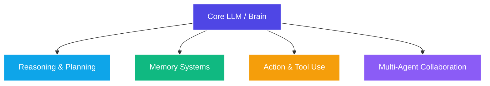

# Comparative Course Audit: AI Agent Curricula & Taxonomy

This report synthesizes findings from an audit of top-tier academic and industry courses on AI Agents to ground the design of a 6-session curriculum tailored for non-developer Product Managers (PMs).

---

## 1. Audited Programs & Key Takeaways

We audited four distinct training styles spanning highly technical academic courses to applied business/product cohort programs:

### Academic/Research-Focused Curricula
*   **Stanford CS224R (Deep Reinforcement Learning & Agentic Systems):**
    *   *Focus:* Deep Reinforcement Learning (RL), policy optimization, reward design, Q-learning, and multi-agent RL (MARL).
    *   *Takeaway:* Concepts like "state spaces," "Markov Decision Processes (MDPs)," and "feedback loops" are fundamental to how agents plan and navigate environments. For PMs, we must translate these mathematical models into visual product logic (e.g., flowcharts and deterministic loops).
*   **UC Berkeley CS294 (LLM Agents / Foundation Models):**
    *   *Focus:* The transition from static foundation LLMs to dynamic agentic systems. Covers prompt-based reasoning (Chain-of-Thought, ReAct), tool integration, and code execution.
    *   *Takeaway:* Berkeley highlights that an agent is a software engineering system, not just a neural network. PMs need to understand how to design and evaluate the orchestration layers surrounding the core LLM.

### Product/Business-Focused Cohorts
*   **Reforge (AI Foundations, AI Evals, & AI Productivity for PMs):**
    *   *Focus:* Prototyping, evaluating non-deterministic system outputs, managing vendor LLM tradeoffs (cost/latency), and leveraging AI for PM operational speed.
    *   *Takeaway:* PMs do not need to write LangChain/Python code, but they must define evaluation metrics (rubrics, golden datasets) and make build-vs-buy decisions based on unit economics.
*   **Section & Maven (Applied AI Cohorts):**
    *   *Focus:* Hands-on integration of ChatGPT, Claude, and simple workflow tools (Zapier/Make) to build personal productivity workflows.
    *   *Takeaway:* Demos must be zero-code and instantly actionable. Aspiring PMs learn best when they configure an agent within minutes and immediately observe its edge-case failures.

---

## 2. The Core Applied AI Agent Taxonomy

Based on the audit, we synthesize a unified taxonomy structured for Product Managers. It translates complex machine-learning concepts into functional product blocks:



### Pillar 1: The Brain (Reasoning Layer)
*   **Definition:** The foundation LLM serving as the cognitive coordinator. It receives input, interprets intent, and formats decisions.
*   **PM Imperative:** Selecting the right brain size (e.g., GPT-4o vs. GPT-4o-mini). A larger brain is smarter but slower and more expensive; a smaller brain is faster but struggles with complex instruction-following.

### Pillar 2: Planning & Self-Correction
*   **Definition:** Decomposing a high-level goal (e.g., "Find and analyze top competitor pricing") into chronological sub-tasks, and reflecting on output to fix mistakes.
*   **PM Imperative:** User trust. If an agent loops endlessly or gets stuck without communicating, the user abandons it. PMs must design "guardrails" and "user-in-the-loop" approval steps.

### Pillar 3: Memory Systems (Working, RAG, & Episodic)
*   **Definition:** 
    *   *Short-term:* The active chat thread / context window.
    *   *Long-term (RAG):* Retrieving relevant documents from a static database to ground answers.
    *   *Episodic:* Remembering past user preferences across separate sessions.
*   **PM Imperative:** Cost and hallucination control. Too much data in the context window increases API costs dramatically; poor retrieval leads to inaccurate agent decisions.

### Pillar 4: Tool Use & The Action Layer
*   **Definition:** Enabling the agent to read/write to the real world (e.g., running code, searching the web, updating a spreadsheet, calling API endpoints).
*   **PM Imperative:** Security and reliability. Non-deterministic tool use can lead to accidental data corruption or security risks. Standardized frameworks like Model Context Protocol (MCP) help streamline tool integrations safely.

### Pillar 5: Multi-Agent Collaboration
*   **Definition:** Decomposing complex workflows among several specialized agents (e.g., a "Researcher Agent" feeds findings to a "Writer Agent" under the supervision of a "PM Agent").
*   **PM Imperative:** Orchestration efficiency. Multi-agent systems can reduce individual task error rates but introduce compounded latency and exponential API costs.

---

## 3. Designing for the PM Learner: Pedagogical Split

Our curriculum implements a **30% Conceptual Theory / 70% PM Strategy & Application** split:

```
[Theory (30%)] ═════▒▒▒▒▒▒▒▒▒▒▒▒▒▒▒▒▒▒▒▒▒▒▒▒▒▒▒ [Applied PM (70%)]
```

*   **Theory (30%):** Demystifying the mechanics (e.g., How RAG queries vector embeddings; how tool-calling functions are generated; what a loop is). This prevents the PM from treating AI as a "magic box" and enables clear communication with engineers.
*   **Applied PM (70%):** Defining product metrics, creating golden datasets for performance evaluations, writing detailed custom instructions, mapping agent state machines, and calculating unit economics.
*   **No-Code Hands-on Focus:** All exercises will be performed in zero-setup web interfaces (such as Custom GPTs, Claude Projects, and Gemini Gems) to ensure students spend 0% of their time debugging environments and 100% of their time designing, configuring, and testing agent behaviors.
